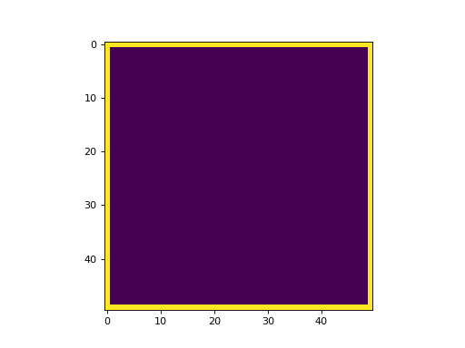

# 2d-heat

A compact 2D heat equation solver and visualization project.



## Summary

This repository computes and visualizes 2D heat diffusion on a rectangular plate. Two C++ examples generate time-series data files in `./build/`, and the Python visualization script converts the result into an animated GIF.

## What’s included

- `src/ex0.cpp` — a sparse linear solve with fixed boundary conditions using Eigen's `SimplicialLLT`.
- `src/ex1.cpp` — a more general solver for boundary conditions on all plate edges using Eigen's `UmfPackLU` support.
- `src/setups.h` — matrix assembly helpers, boundary setup, and plate I/O functions.
- `src/display.py` — reads generated data, creates a frame-by-frame animation, and saves a GIF.
- `app/input.txt` — sample simulation parameters for both examples.
- `app/gen_data.sh` / `app/gen_anim.sh` — helper scripts for generating data and animations.
- `build/data0.txt` / `build/data1.txt` — precomputed simulation output files.

## How to use

1. Build the C++ examples with the provided `Makefile`:
   ```bash
   make
   ```
   This produces `./build/ex0.exe` and `./build/ex1.exe`.
2. Generate data using one of the binaries or the helper script:
   - Run `./build/ex0.exe` to write `./build/data0.txt`.
   - Run `./build/ex1.exe` to write `./build/data1.txt`.
   - Or use `./app/gen_data.sh` to generate both data files from `app/input.txt`.
3. Create the animation with the Python visualizer:
   ```bash
   bash ./app/gen_anim.sh
   ```
   The script reads the selected `build/data*.txt` file and saves the result as `animation0.gif` or `animation1.gif`.
4. View the generated animation:
   - The main output file is `./build/animation1.gif`.
   - Use any GIF viewer or browser to inspect the heat diffusion sequence.

## Output

The animation at `./build/animation1.gif` shows the heat diffusion over time, using a consistent colormap for clear comparison between simulation frames.
